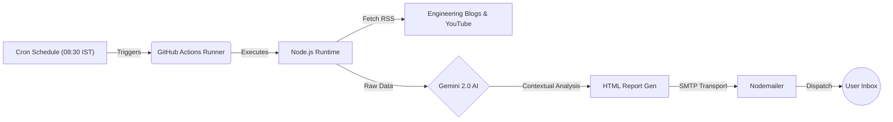

***

# 🚀 Topic Master

### Autonomous Career Growth Agent & Knowledge Aggregator

   

**Topic Master** is a serverless, AI-driven automation tool designed to accelerate career growth in **DevOps** and **Distributed Systems**.

Acting as a "Personal CTO," this agent autonomously aggregates high-value engineering resources from top industry sources (Netflix, Uber, AWS), filters them for relevance using **Google's Gemini 2.0 Flash** model, and delivers a structured daily briefing covering scalability patterns and system design concepts.

---

## 🏗️ System Architecture

The system follows a **GitOps** and **Event-Driven** architecture, utilizing ephemeral compute containers to minimize costs.



## 🛠️ Tech Stack

*   **Runtime:** Node.js (Async/Await Pattern)
*   **Artificial Intelligence:** Google Gemini 2.0 Flash (High-throughput, low-latency reasoning)
*   **Orchestration:** GitHub Actions (Scheduled Workflows)
*   **Data Ingestion:** XML/RSS Parsing via `rss-parser`
*   **Notification:** SMTP via `nodemailer`

---

## ✨ Key Features

*   **🧠 Context-Aware Filtering:** Unlike standard RSS readers, this agent uses LLMs to read article titles and selects only the **top 2** resources relevant to a "DevOps/SRE" career path.
*   **🎓 Daily Design Drill:** Generates a unique, bite-sized lesson on complex topics (e.g., *Consistent Hashing, Raft Consensus, Bloom Filters*) with specific "Interview Pro-Tips."
*   **⚡ Zero-Cost Infrastructure:** Runs entirely on free-tier compute (GitHub Actions) and free-tier AI API.
*   **🛡️ Robust Error Handling:** Implements graceful degradation—if the AI fails, the pipeline logs the error and exits cleanly without crashing the workflow.

---

## 📂 Project Structure

```bash
topic-master/
├── .github/
│   └── workflows/
│       └── daily_agent.yml   # CI/CD Schedule Configuration
├── index.js                  # Core Logic (Fetcher -> AI -> Emailer)
├── check_models.js           # Utility to list available Gemini models
├── package.json              # Dependencies
└── README.md                 # System Documentation
```

---

## 🚀 Local Setup & Installation

To run this agent on your local machine for development:

1.  **Clone the Repository**
    ```bash
    git clone https://github.com/YashashavGoyal/topic-master.git
    cd topic-master
    ```

2.  **Install Dependencies**
    ```bash
    npm install
    ```

3.  **Environment Configuration**
    Create a `.env` file in the root directory:
    ```env
    GEMINI_API_KEY=your_google_ai_studio_key
    EMAIL_USER=your_gmail_address
    EMAIL_PASS=your_app_password_16_chars
    TARGET_EMAIL=destination_email_address
    ```

4.  **Run the Agent**
    ```bash
    node index.js
    ```

---

## 🔧 Troubleshooting

**Issue: `404 Not Found` for Gemini Model**
Google frequently updates model names (e.g., `gemini-1.5-flash` vs `gemini-2.0-flash`).
1. Run the utility script to see which models your API key has access to:
   ```bash
   node check_models.js
   ```
2. Update the `model` string in `index.js` with a supported ID from the list.

**Issue: Script hangs after sending email**
Ensure `process.exit(0)` is called after `transporter.sendMail()`. Node.js event loops stay active as long as the SMTP connection is open unless explicitly terminated.

---

## 🤖 CI/CD Automation

This project is deployed using **GitHub Actions**.
*   **Trigger:** Schedule (Cron)
*   **Frequency:** Daily at 03:00 UTC (08:30 IST)
*   **Secrets:** Managed via GitHub Repository Settings > Secrets and variables.

---

## 👤 Author

**Yashashav Goyal**
*   *Role:* Aspiring DevOps / SRE Engineer
*   *Focus:* Automation, Cloud Native, High-Scale Architecture
*   [LinkedIn](https://linkedin.com/in/yashashavgoyal) | [GitHub](https://github.com/YashashavGoyal)