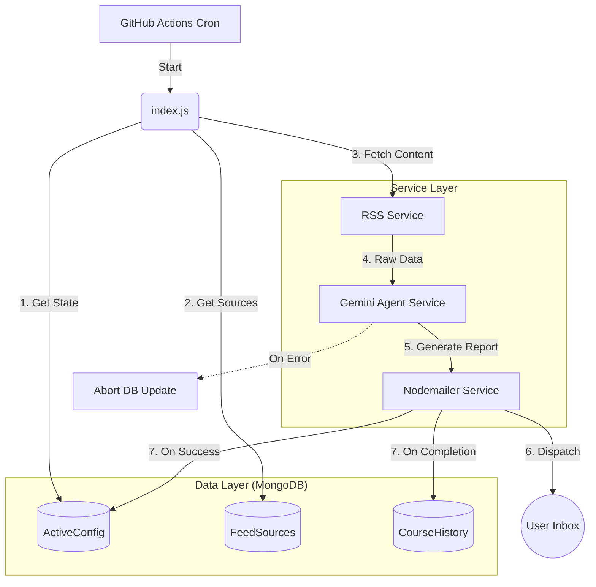

***

# 🚀 Topic Master

### The Autonomous AI Career Architect & Learning Agent

   

**Topic Master** is a stateful, fully automated agent designed to orchestrate a structured learning path for **System Design** and **DevOps**.

Unlike simple RSS aggregators, this system maintains **persistent state** via MongoDB to track course progress (`Lesson 5 of 20`), executes **transactional updates** (rollback on failure), and utilizes **Generative AI** to act as a personal mentor, analyzing complex engineering topics from Netflix, Uber, and AWS.

---

## 🏗️ System Architecture

The project follows a **Service-Oriented Architecture (SOA)**, decoupling business logic (AI/Email) from data access (Models) and configuration.



---

## 📂 Modular Project Structure

The codebase is organized into modular services to ensure scalability and testability.

```bash
topic-master/
├── .github/workflows/    # CI/CD Pipelines
├── .env                  # Environment Variables (Secrets)
├── package.json          # Dependencies
├── index.js              # 🧠 The Orchestrator (Entry Point)
└── src/
    ├── config/
    │   └── db.js         # MongoDB Connection Logic
    ├── models/           # Mongoose Schemas (Data Layer)
    │   ├── ActiveConfig.js   # Tracks current playlist progress
    │   ├── CourseHistory.js  # Archives completed courses
    │   └── FeedSource.js     # Manages Blogs & YouTube channels
    ├── services/         # Business Logic Layer
    │   ├── fetcher.js    # RSS Parsing & Aggregation
    │   ├── aiAgent.js    # Gemini AI Prompt Engineering
    │   └── emailer.js    # SMTP Transport Service
    └── utils/
        ├── seeder.js     # Auto-initializes DB defaults
        └── checkModels.js # Utility to verify AI Model availability
```

---

## 🛠️ Tech Stack & Patterns

*   **Runtime:** Node.js (Async/Await).
*   **Database:** MongoDB Atlas (Mongoose ODM).
*   **AI Engine:** Google Gemini 2.0 Flash (Context-aware analysis).
*   **Design Pattern:** Service-Oriented Architecture (SOA).
*   **Reliability:** Transactional Integrity (Database only updates if the AI & Email services succeed).
*   **Infrastructure:** Serverless (GitHub Actions).

---

## 🚀 Setup & Installation

### 1. Clone & Install
```bash
git clone https://github.com/YashashavGoyal/topic-master.git
cd topic-master
npm install
```

### 2. Configure Environment
Create a `.env` file in the root directory:
```env
# Database (MongoDB Atlas)
MONGODB_URI=mongodb+srv://<user>:<pass>@cluster.mongodb.net/topic-master

# AI Provider (Google AI Studio)
GEMINI_API_KEY=your_api_key

# Email Service (Gmail App Password)
EMAIL_USER=your_email@gmail.com
EMAIL_PASS=your_16_char_app_password
TARGET_EMAIL=where_to_send_emails@gmail.com
```

### 3. Database Initialization (Auto-Seeding)
You do not need to manually create collections. On the first run, the system detects an empty database and automatically seeds it with:
*   Default System Design Playlist.
*   Top Engineering Blogs (Netflix, Uber, AWS).

Run the agent:
```bash
node index.js
```

---

## ⚙️ Managing the Agent (Admin Panel)

Since the state is stored in MongoDB, you manage the agent using **MongoDB Compass** or the **Atlas Dashboard**.

### 🔄 Changing the Learning Topic
To switch from "System Design" to "Kubernetes":
1.  Open the `activeconfigs` collection.
2.  Update the document:
    *   `playlistId`: `[Paste New YouTube Playlist ID]`
    *   `currentVideoIndex`: `0`
    *   `status`: `"start"`
3.  Save. The agent will automatically start the new course on the next run.

### 📰 Adding New News Sources
To add a new engineering blog:
1.  Open the `feedsources` collection.
2.  Insert a new document:
    ```json
    {
      "url": "https://discord.com/blog/rss",
      "name": "Discord Engineering",
      "type": "blog"
    }
    ```

---

## 🛡️ Error Handling & Safety

This system implements **"Safe State Updates"**:
*   **Scenario:** The AI API is down or returns an error.
*   **Action:** The system logs the error and **aborts** the database update.
*   **Result:** Your progress is preserved. You will retry the same lesson on the next run, ensuring you never miss a topic due to technical failures.

---

## 👤 Author

**Yashashav Goyal**
*   *Role:* Aspiring DevOps / SRE Engineer
*   *Focus:* Distributed Systems, Automation, Cloud Architecture
*   [LinkedIn](https://linkedin.com/in/yashashavgoyal) | [GitHub](https://github.com/YashashavGoyal)